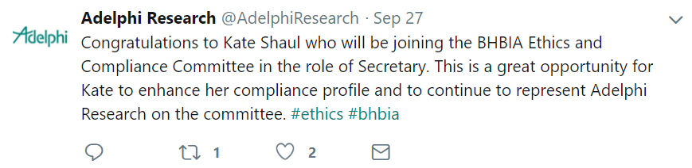

<style type="text/css">


.sbframe-commentary {
font-size: 20px;
}

.sbframe-commentary h4 {
font-size: 20px;
}

.chart-title {
font-size: 22px;
}

.chart-wrapper ul li {
font-size: 20px;
}

.chart-wrapper h4 {
font-size: 24px;
}


.storyboard-nav .sbframelist ul li {
font-size: 22px;
}

.storyboard-nav .sbframelist {
margin: 0 auto;
width: 94%;
height: 50px;
overflow: hidden;
text-shadow: none;
margin-bottom: 8px;
}

.storyboard-nav .sbnext, .storyboard-nav .sbprev {
float: left;
width: 2%;
height: 50px;
font-size: 50px;
}

</style>

```{r setup, include = FALSE, message = FALSE}
# flexdashboard themes: journal, united, sandstone ----

# load packages ----
library(flexdashboard)
library(tidyverse)
library(lubridate)
library(scales)
library(tidytext)
library(widyr)
library(ggraph)
library(igraph)
library(glmnet)
library(DT)

# ggplot colors ----
gg_color_hue <- function(n) {
  hues = seq(15, 375, length = n + 1)
  hcl(h = hues, l = 65, c = 100)[1:n]
}
n <- 3
my_cols <- gg_color_hue(n)

# load tweets ----
ar_tweets <- readRDS(file = "data/ar_tweets.rds")

# total number of tweets downloaded ----
n_all <- nrow(ar_tweets)

# number of variables in original data set ----
num_var_start <- ncol(ar_tweets)

# create new variables ----
ar_tweets <- ar_tweets %>%
  mutate(type = fct_relevel(
    case_when(
      is_retweet == F & is_quote == F ~ "original",
      is_retweet == T & is_quote == F ~ "RT no comment",
      is_retweet == F & is_quote == T ~ "RT w/ comment"
    )),
    has_url = case_when(
      is.na(urls_url) == TRUE ~ FALSE,
      TRUE ~ TRUE
      ),
    has_photo = case_when(
      media_type == "photo" ~ TRUE,
      TRUE ~ FALSE
    ),
    num_hashtags = purrr::map_int(hashtags,~sum(!is.na(.x))), 
    atleast_1_like = favorite_count > 0,
    atleast_1_retweet = retweet_count > 0,
    atleast_1_hashtag = num_hashtags > 0,
    month = month(created_at),
    year = year(created_at),
    month_year = ymd(paste(year, month, 1, sep = '-')),
    post_id = row_number()
    )

# number of variables added to data set ----
num_var_add <- ncol(ar_tweets) - num_var_start

# create date grid to zero fill empty months ----
date_grid <- as_tibble(expand.grid(month = 1:12, year = 2009:2018)) %>%  
  mutate(month_year = ymd(paste(year, month, 1, sep = '-')))

# reduce data set to original tweets with select variables ---
ar_original <- ar_tweets %>% 
  filter(type == "original") %>% 
  select(created_at, text, display_text_width, is_retweet, is_quote,
         favorite_count, retweet_count, hashtags, media_type, lang, 
         retweet_location, retweet_screen_name, type, has_url, has_photo,
         num_hashtags, atleast_1_like, atleast_1_retweet, atleast_1_hashtag,
         month, year, month_year, post_id) 

# number of original tweets ----
n_original <- nrow(ar_original)

# compute percentages for at least 1 like and at least 1 retweet
popularity <- ar_original %>% 
  count(atleast_1_like, atleast_1_retweet) %>% 
  mutate(my_prop = n / sum(n),
         my_percent = my_prop * 100,
         label = percent(my_prop %>% round(3))) 

# number of tweets per year ----
num_tweets_year <- ar_original %>% 
  count(year) %>% 
  mutate(n_tweets = n) %>% 
  select(year, n_tweets)

# compute percent of tweets with at least one hashtag ----
percent_ht <- ar_original %>% 
  count(atleast_1_hashtag) %>%
   mutate(my_prop = n / sum(n),
         my_perc = percent(my_prop %>% round(3))) %>% 
  select(my_perc)

# compute max number of hashtags ----
max_ht <- ar_original %>% 
  summarize(check = max(num_hashtags))

# data frame of hash tags ----
ar_hashtags <- ar_original %>% 
  unnest(hashtags) %>% 
  mutate(hashtags_lc = tolower(hashtags),
         hashtags_theme =  case_when(
            str_detect(hashtags_lc, "bhbia") == TRUE |
              str_detect(hashtags_lc, "bobi") == TRUE ~ "bhbia",
            # ------------------------------------------------------
            str_detect(hashtags_lc, "mentalhealth") == TRUE ~ "mentalhealth",
            str_detect(hashtags_lc, "pharm") == TRUE ~ "pharma",
            str_detect(hashtags_lc, "marketresearch") == TRUE ~ "mrx",
            str_detect(hashtags_lc, "adelphi") == TRUE ~ "adelphi",
            str_detect(hashtags_lc, "mrs") == TRUE ~ "mrs",
            # ------------------------------------------------------
            str_detect(hashtags_lc, "cancer") == TRUE |
              str_detect(hashtags_lc, "oncolgy") == TRUE |
              str_detect(hashtags_lc, "chemo") == TRUE |
              str_detect(hashtags_lc, "oncology") == TRUE
              ~ "cancer",
            # ------------------------------------------------------
            str_detect(hashtags_lc, "patient") == TRUE ~ "patient",
            # ------------------------------------------------------
            str_detect(hashtags_lc, "nhs") == TRUE & 
              !str_detect(hashtags_lc, "nhsnuggets") == TRUE~ "nhs",
            # ------------------------------------------------------
            str_detect(hashtags_lc, "behaviouraleconomics") == TRUE 
              ~ "behavioraleconomics",
            # ------------------------------------------------------
            str_detect(hashtags_lc, "downsyndrome") == TRUE | 
              str_detect(hashtags_lc, "wdsd") == TRUE ~ "downsyndrome",
            # ------------------------------------------------------
            str_detect(hashtags_lc, "wearable") == TRUE ~ "wearable",
            # ------------------------------------------------------
            TRUE ~ hashtags_lc
          )) %>% 
  filter(is.na(hashtags) == F)

# hashtags with at least 50 occurrences ----
top_hashtags <- ar_hashtags %>% 
  count(hashtags_theme, sort = T) %>% 
  filter(n >= 50) %>% 
  select(hashtags_theme)

# grid to zero fill hashtags over year ----
hash_grid <- as_tibble(expand.grid(hashtags_theme = top_hashtags[["hashtags_theme"]],
                                   year = 2011:2018))

# summarize hashtags over year ----
ar_hashtags_year <- ar_hashtags %>% 
  group_by(year) %>% 
  count(hashtags_theme) %>% 
  filter(hashtags_theme %in% top_hashtags[["hashtags_theme"]]) %>%
  right_join(hash_grid) %>% 
  left_join(num_tweets_year, by = "year") %>% 
  mutate(n = replace_na(n, 0),
         hash_per_tweet = n / n_tweets,
         hpt_pct = hash_per_tweet * 100,
         hpt_label = percent(hash_per_tweet %>% round(3)))
```

Introduction {.storyboard}
=========================================

### Example tweet {data-commentary-width=550}

<blockquote class="twitter-tweet" data-lang="en"><p lang="en" dir="ltr">We are feeling festive!! The Christmas boxes for Operation Christmas child are packed and ready to go. We packed 22 this year and they will go to Children in need around the world. <a href="https://twitter.com/hashtag/Samaritanspurse?src=hash&amp;ref_src=twsrc%5Etfw">#Samaritanspurse</a> <a href="https://twitter.com/hashtag/christmasboxes?src=hash&amp;ref_src=twsrc%5Etfw">#christmasboxes</a> <a href="https://t.co/IE2nAQHeuO">pic.twitter.com/IE2nAQHeuO</a></p>&mdash; Adelphi Research (@AdelphiResearch) <a href="https://twitter.com/AdelphiResearch/status/1064553799417769989?ref_src=twsrc%5Etfw">November 19, 2018</a></blockquote>
<script async src="https://platform.twitter.com/widgets.js" charset="utf-8"></script>

***
#### Shiny Apps
* [Tweet look-up](https://spileggi.shinyapps.io/tweet_lookup/)
* [Term network analysis](https://spileggi.shinyapps.io/tweet_network/)


### Motivation

* Learn about Adelphi Research's values and initiatives.
* Provide Adelphi Research with insights regarding tweet themes and popularity.
* Explore R packages
  + First time: `rtweet`, `scales`, `tidytext`, `widyr`, `ggraph`, `igraph`, `corrr`, `glmnet`
  + Continued learning: `tidyverse`, `forcats`, `skimr`, `lubridate`, `broom`, `flexdashboard`, `DT`
* Presentation checklist:
  + focuses on market research
  + innovative
  + proud of

### Things I learned

#### Acronyms

* BHBIA = British Healthcare Business Intelligence Association
  + BOBI = Best of Business Intelligence
* NHS = National Health Service (UK)
* MRS = Market Research Society (UK)
* NICE = National Institute for Health and Care Excellence (UK)
* CDF = Cancer Drugs Fund (England)
* #mrx = market research

#### Interests

* Probably a lot of market research in cancer treatments.
* Other areas?

#### Miscellaneous

* Adelphi Research wrote an [NHS Nuggets blog](http://nhsnuggets.blogspot.com/) from 2011 to 2015
* In 2016 & 2017, participated in a campaign to [plant fruit trees](https://twitter.com/search?q=%40AdelphiResearch%20fruit%20trees&src=typd) in Africa 
* [Adelphi illuminate innovation lab](http://www.adelphiresearchglobal.com/wish-you-could-be-a-fly-on-the-wall-at-a-doctors-office/) is testing market research + virtual reality
* Adelphi's pro-bono work in [Creating a wave of change in the Mental Health Act](http://www.pharmatimes.com/web_exclusives/creating_a_wave_of_change_in_the_mental_health_act_1241509)
* The Guardian is Bristish daily newspaper.
* Adelphi operates independently from Omnicom Group?


Tweet overview {.storyboard}
=========================================


### Tweets over time

```{r tweet_time_series}
date_grid %>% 
  left_join(ar_tweets, by = "month_year") %>%
  group_by(month_year) %>% 
  summarise(num_tweets = sum(!is.na(text))) %>% 
  ggplot(aes(x = month_year, y = num_tweets)) +
    geom_point(color = "gray") + 
    geom_smooth(col = my_cols[1], lwd = 1.5, se = F, method = "loess", span = 0.1) +
    theme_minimal() +
    theme(plot.title = element_text(face = "bold"),
        axis.text.x = element_text(size = rel(1.5)),
        axis.text.y = element_text(size = rel(1.5)),
        axis.title.y = element_text(size = rel(1.5))) +
    labs(x = NULL, 
       y = "Number of tweets",
       title = "Frequency of @AdelphiResearch tweets",
       subtitle = bquote(.(n_all) ~ "total tweets aggregated by month"),
       caption = "\nSource: Data collected from Twitter's REST API via rtweet")
```

***

* `r nrow(ar_tweets)` tweets 
* all originate from `r ar_tweets %>% count(location) %>% .[[1]]` 
* tweets begin at `r ar_tweets$created_at[nrow(ar_tweets)]`, end at `r ar_tweets$created_at[1]`
* original data set has `r num_var_start` variables
* created an additional `r num_var_add` variables for analysis

### Tweet type {data-commentary-width=550}

```{r type_of_tweet}
ar_tweets %>% 
  group_by(type) %>%
  summarise(count = n()) %>% 
  mutate(my_prop = count / sum(count),
         my_percent = my_prop * 100,
         label2 = percent(my_prop %>% round(3))) %>% 
  ggplot(aes(x = type, y = my_percent)) +
    geom_bar(stat = "identity", aes(fill = type)) +
    geom_text(aes(label = label2), vjust = - 0.3) +
    theme_minimal() +
    theme(plot.title = element_text(face = "bold"),
        axis.text.x = element_text(size = rel(1.5)),
        axis.text.y = element_blank(),
        axis.ticks.y = element_blank(),
        legend.position = "none") +
    labs(x = NULL, 
       y = NULL,
       title = "Type of @AdelphiResearch tweets",
       subtitle = bquote(.(n_all) ~ "total tweets"))
```


***

#### **Original tweet**
```{r figure_1, out.width = "450px"}

```

#### **RT no comment**
```{r figure_2, out.width = "450px"}
knitr::include_graphics("figures/rt.png")
```

#### **RT w/ comment**
```{r figure_3, out.width = "450px"}
knitr::include_graphics("figures/rt_comment.png")
```


### Likes and retweets {data-commentary-width=650}

```{r popularity_barplot}
labels <- c(favorite_count = "# of likes", 
            retweet_count = "# of retweets")

ar_original %>% 
  select(favorite_count, retweet_count) %>% 
  gather(key = popularity, value = number) %>% 
  group_by(popularity) %>% 
  count(number) %>% 
  ggplot(aes(x = number, y = n, fill = popularity)) +
    geom_bar(stat = "identity") +
    facet_grid(. ~ popularity, , labeller = labeller(popularity = labels)) +
    # geom_text(aes(label = n), vjust = -0.2) +
    theme_minimal() +
    ylim(0, 900) +
    theme(plot.title = element_text(face = "bold"),
          axis.text.x = element_text(size = rel(1.5)),
          axis.text.y = element_text(size = rel(1.5)),
          axis.title.x = element_text(size = rel(1.5)),
          axis.title.y = element_text(size = rel(1.5)),
          strip.text.x = element_text(size = rel(1.5)),
          legend.position = "none") +
    labs(x = "", 
         y = "Frequency",
         title = "Popularity for original @AdelphiResearch tweets",
         subtitle = bquote(.(n_original) ~ "total tweets"))
```
[Most retweeted original tweet](https://twitter.com/search?f=tweets&q=%40AdelphiResearch%20New%20drug%20kills%20antibiotic-resistant%20bacteria%20&src=typd) 

[Most liked original tweet](https://twitter.com/search?q=%40AdelphiResearch%20wearing%20yellow&src=typd)

***

```{r popularity_time_series}
ar_original %>% 
  group_by(year) %>% 
  summarize(like_total = sum(favorite_count),
            retweet_total = sum(retweet_count),
            hashtag_total = sum(num_hashtags)) %>% 
  left_join(num_tweets_year, by = "year") %>% 
  filter(year > 2009) %>% 
  mutate(Likes = like_total / n_tweets,
            Retweets = retweet_total / n_tweets,
            hashtag_per_tweet = hashtag_total / n_tweets) %>%
  select(year, Likes, Retweets) %>% 
  gather(key = measure, value = ratio, -year) %>% 
  ggplot(aes(x = year, y = ratio, group = measure)) +
    geom_hline(yintercept = 1, lty = 2, col = "gray", lwd = 1.5) +
    geom_line(aes(col = measure)) +
    geom_point(aes(col = measure)) +
    theme_minimal() +
    theme(plot.title = element_text(face = "bold"),
          axis.text.x = element_text(size = rel(1.5)),
          axis.text.y = element_text(size = rel(1.5)),
          axis.title.x = element_text(size = rel(1.5)),
          axis.title.y = element_text(size = rel(1.5)),
          legend.title = element_text(size = rel(1.2)),
          legend.text = element_text(size = rel(1.2)),
          legend.justification = "left", 
          legend.position = c(0.1, 0.8),
          legend.background = element_rect(fill = "white")) +
    labs(x = "Year", 
         y = "Count per tweet",
         color = "Popularity",
         title = "Original @AdelphiResearch tweets over time",
         subtitle = bquote(.(n_original) ~ "total tweets"))

```


Hashtags {.storyboard}
=========================================

### Common hashtag themes {data-commentary-width=550}


```{r hashtag_table}
DT::datatable(ar_hashtags %>% count(hashtags_theme, sort = T), 
              options = list(pageLength = 10),
              colnames = c('Hashtag theme', 'Frequency'))
```

***

#### `r n_original` tweets: 

* `r percent_ht[1,1]` have 0 hashtags
* `r percent_ht[2,1]` have 1 to `r max_ht` hashtags


#### `r nrow(ar_hashtags)` hashtags used:

* `r ar_hashtags %>% count(hashtags) %>% n_distinct` unique hashtags
* `r ar_hashtags %>% count(hashtags_theme) %>% n_distinct` unique hashtag themes
  + bhbia, bobi -> bhbia
  + cancer, oncology, chemo -> cancer
  + mrx, marketresearch -> mrx
  
  
### Hashtag theme trends {data-commentary-width=650}
```{r hashtag_time_series}
ar_hashtags_year %>% 
    ggplot(aes(x = year, y = n, group = hashtags_theme)) +
    geom_line(aes(col = fct_reorder(hashtags_theme, n, .desc = T))) +
    geom_point(aes(col = hashtags_theme)) +
    theme_minimal() +
    theme(plot.title = element_text(face = "bold"),
          axis.text.x = element_text(size = rel(1.5)),
          axis.text.y = element_text(size = rel(1.5)),
          axis.title.x = element_text(size = rel(1.5)),
          axis.title.y = element_text(size = rel(1.5)),
          legend.title = element_text(size = rel(1.2)),
          legend.text = element_text(size = rel(1.2))) +
    labs(x = "Year", 
         y = "Number of occurrences",
         color = "Hashtag theme",
         title = "Hashtag themes over time",
         subtitle = "Hashtag themes with at least 50 occurrences")
```  

***
```{r popularity_hashtag}
labels <- c(favorite_count = "# likes", 
            retweet_count = "# retweets")

ar_hashtags %>% 
  add_count(hashtags_theme) %>% 
  filter(n > 50) %>% 
  select(favorite_count, retweet_count, hashtags_theme) %>% 
  gather(key = "popularity", value = "count", -hashtags_theme) %>% 
  mutate(hashtags_theme = fct_rev(fct_relevel(hashtags_theme, 
                                        "healthcare", "nhs", "cancer",
                                        "bhbia", "mrx", "pharma"))) %>% 
  ggplot(aes(x = hashtags_theme, 
             y = count, 
             fill = popularity)) +
    geom_violin() +
    coord_flip() +
    facet_wrap(. ~ popularity, labeller = labeller(popularity = labels)) +
    theme_minimal() +
    theme(plot.title = element_text(face = "bold"),
          axis.text.x = element_text(size = rel(1.5)),
          axis.text.y = element_text(size = rel(1.5)),
          axis.title.x = element_text(size = rel(1.5)),
          axis.title.y = element_text(size = rel(1.5)),
          strip.text = element_text(size = rel(1.2)),
          legend.position = "none") +
    labs(y = NULL, 
         x = NULL,
         color = "Popularity",
         title = "Likes and retweets of common hashtag themes",
         subtitle = "Hashtag themes with at least 50 occurrences")
```


### Hashtag network 
```{r hashtag_network_likes}
hashtag_popularity <- ar_hashtags %>% 
  add_count(hashtags_theme) %>% 
  group_by(hashtags_theme) %>% 
  summarize(median_likes = median(favorite_count),
            median_retweets = median(retweet_count),
            total_likes = sum(favorite_count),
            total_retweets = sum(retweet_count),
            geom_mean_likes = exp(mean(log(favorite_count + 1))),
            geom_mean_retweets = exp(mean(log(retweet_count + 1))),
            occurrences = n()) %>% 
  arrange(desc(occurrences)) 

hashtags_filtered <- ar_hashtags %>% 
  add_count(hashtags_theme) %>% 
  filter(n > 5)

top_corrs_ht <- hashtags_filtered %>% 
  select(post_id, hashtags_theme) %>% 
  pairwise_cor(hashtags_theme, post_id, sort = T) %>% 
  head(50)
  
vertices_ht <- hashtag_popularity %>% 
  filter(hashtags_theme %in% top_corrs_ht$item1 | hashtags_theme %in% top_corrs_ht$item2)

set.seed(2018)

top_corrs_ht %>% 
  graph_from_data_frame(vertices = vertices_ht) %>% 
    ggraph() +
    geom_edge_link() + 
    # geom_node_point(aes(size = occurrences * 1.1)) +
    geom_node_point(aes(size = occurrences,
                        color = geom_mean_retweets)) + 
    geom_node_text(aes(label = name), repel = TRUE) + 
    theme_void() +
    labs(color = "Average retweets",
         size = "Frequency",
         title = "Frequency, retweets, and relationships among @AdelphiResearch hashtags",
         subtitle = "Hashtags with at least 5 occurrences") +
    scale_color_gradient(low='#E1FA72', high='#F46FEE') +
    scale_size_continuous(range = c(3, 8)) 
    
```


Tweet text {.storyboard}
=========================================

### Text network 

```{r word_network_retweets}
text_words <- ar_original %>% 
  select(post_id, created_at, favorite_count, retweet_count, text) %>% 
  unnest_tokens(word, text) %>% 
  anti_join(stop_words, by = "word") %>% 
  filter(!(word %in% c("t.co", "http", "https", "amp", "rt")),
         str_detect(word, "[a-z]"))

text_words_popularity <- text_words %>% 
  add_count(word) %>% 
  group_by(word) %>% 
  summarize(median_likes = median(favorite_count),
            median_retweets = median(retweet_count),
            total_likes = sum(favorite_count),
            total_retweets = sum(retweet_count),
            geom_mean_likes = exp(mean(log(favorite_count + 1))),
            geom_mean_retweets = exp(mean(log(retweet_count + 1))),
            occurrences = n()) %>% 
  arrange(desc(occurrences)) 
  

top_corrs_text <- text_words %>% 
  add_count(word) %>% 
  filter(n > 5) %>% 
  select(post_id, word) %>% 
  pairwise_cor(word, post_id, sort = T) %>% 
  head(100)

vertices_text <- text_words_popularity %>% 
  filter(word %in% top_corrs_text$item1 | word %in% top_corrs_text$item2)

set.seed(2018)

top_corrs_text %>% 
  graph_from_data_frame(vertices = vertices_text) %>% 
    ggraph() +
    geom_edge_link() + 
    # geom_node_point(aes(size = occurrences * 1.1)) +
    geom_node_point(aes(size = occurrences,
                        color = geom_mean_retweets)) + 
    geom_node_text(aes(label = name), repel = TRUE) + 
    theme_void() +
    labs(color = "Average retweets",
         size = "Frequency",
         title = "Frequency, retweets, and relationships among top 100 words") +
    scale_color_gradient(low='#E1FA72', high='#F46FEE') +
    scale_size_continuous(range = c(3, 8)) 

```

### LASSO model {data-commentary-width=650}
```{r lasso_likes}
tweet_word_matrix <- text_words %>% 
  add_count(word) %>% 
  filter(n > 30) %>% 
  distinct(post_id, word, favorite_count) %>% 
  cast_sparse(post_id, word)

check <- match(rownames(tweet_word_matrix), ar_original$post_id)
likes <- ar_original$favorite_count[check]

set.seed(2018)
lasso_model <- cv.glmnet(tweet_word_matrix, log(likes + 1))

tidy(lasso_model$glmnet.fit) %>%
  filter(lambda == lasso_model$lambda.min) %>%
  filter(term != "(Intercept)") %>%
  mutate(term = reorder(term, estimate)) %>%  
  ggplot(aes(x = term, y = estimate, fill = estimate < 0)) +
  geom_col() +
  coord_flip() +
  theme_minimal() +
    theme(plot.title = element_text(face = "bold"),
          axis.text.x = element_text(size = rel(1.5)),
          axis.text.y = element_text(size = rel(1.2)),
          axis.title.x = element_text(size = rel(1.5)),
          axis.title.y = element_text(size = rel(1.5)),
          strip.text = element_text(size = rel(1.2)),
          legend.justification = "left", 
          legend.position = c(0.8, 0.2),
          legend.background = element_rect(fill = "white")) +
    labs(y = "Estimate", 
         x = NULL,
         title = "Word associations with likes",
         subtitle = "Words with at least 30 occurrences") +
    scale_fill_discrete(name = "Association",
                      breaks = c(FALSE, TRUE),
                      labels = c("Positive", "Negative"))

```

***
```{r lasso_retweets}
tweet_word_matrix <- text_words %>% 
  add_count(word) %>% 
  filter(n > 30) %>% 
  distinct(post_id, word, retweet_count) %>% 
  cast_sparse(post_id, word)

check <- match(rownames(tweet_word_matrix), ar_original$post_id)
retweets <- ar_original$retweet_count[check]

set.seed(2018)
lasso_model <- cv.glmnet(tweet_word_matrix, log(retweets + 1))

tidy(lasso_model$glmnet.fit) %>%
  filter(lambda == lasso_model$lambda.min) %>%
  filter(term != "(Intercept)") %>%
  mutate(term = reorder(term, estimate)) %>%  
  ggplot(aes(x = term, y = estimate, fill = estimate < 0)) +
  geom_col() +
  coord_flip() +
  theme_minimal() +
    theme(plot.title = element_text(face = "bold"),
          axis.text.x = element_text(size = rel(1.5)),
          axis.text.y = element_text(size = rel(1.2)),
          axis.title.x = element_text(size = rel(1.5)),
          axis.title.y = element_text(size = rel(1.5)),
          strip.text = element_text(size = rel(1.2)),
          legend.justification = "left", 
          legend.position = c(0.8, 0.2),
          legend.background = element_rect(fill = "white")) +
    labs(y = "Estimate", 
         x = NULL,
         title = "Word associations with retweets",
         subtitle = "Words with at least 30 occurrences") +
    scale_fill_discrete(name = "Association",
                      breaks = c(FALSE, TRUE),
                      labels = c("Positive", "Negative"))

```


Summary 
=========================================

Row
-------------------------------------
    
### Key findings

#### Overall    
* The frequency of tweets is descreasing in 2018, but like-to-tweet and retweet-to-tweet ratios are increasing.

#### Hashtag themes    
* `#healthcare` and `#nhs` peaked in 2015 - related to UK or US?
* No clear trends between common hashtag themes and likes or retweets.
* `#mrx` / `#marketresearch` occur frequently and often appear with other hashtags.
* `#innovation` tends to get more likes; `#mrs` and `#bhbia` tends to get more retweets.

#### Tweet text

* _Network analysis_: words that got together and tend to get more likes/retweets 
  + won, BHBIA, BOBI awards
  + creating, change, wave ([this](https://twitter.com/AdelphiResearch/status/996412063907016704))
  + ready, boxes, involved, children

* _Model analysis_: words associated with retweets/likes
  + positively -> conference, team
  + negatively ->  UK, guardian
  

Row
-------------------------------------
### Future work 

* Incorporate other variables in a unified model.
* Consider elastic net model for correlated variables.
* Examine network of retweet-ers.
* Sentiment analysis of tweet text.
* Build app to predict number retweets/likes based on input words or hashtags.

### Applications

* Text analysis of open-ended survey data.
* Text analysis of open-ended claims data.
* Reproducible reports for tight deadlines.
* Social media in market research.


### Acknowledgements 

* [&commat;drob's #tidytuesday screencast on analyzing Medium posts](https://twitter.com/drob/status/1069954125020958720)
* [&commat;EmilyRiederer's suggestion to do a presentation using flexdashboard](https://twitter.com/EmilyRiederer/status/1073001289339027456)


